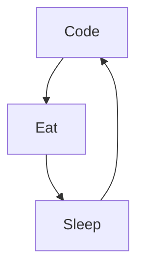

### Hi Everyone, I"m Maxvyr

<!--
**Maxvyr/Maxvyr** is a ✨ _special_ ✨ repository because its `README.md` (this file) appears on your GitHub profile.

Here are some ideas to get you started:
-->

- 🔭 I’m currently working on Web Application
- 🌱 I’m currently learning **[Typescript](https://www.typescriptlang.org/), [NextJS](https://nextjs.org/)**
- 👯  I’m looking to collaborate on **OpenSource Projects**

- 📫 How to reach me: **[Instagram](https://www.instagram.com/maxvyr_/)**, **[LinkedIn](https://www.linkedin.com/in/maxime-vidalinc)**, **contact@maxvyr.xyz**
- ⚡ About Me: 
  - **🧑‍💻 Indie Makers**
  - **🧘 Personnal developpment**
  - **🏦 finance**
  - **🛫 Indonesia**
  - **💖 japan 🇯🇵 and korean 🇰🇷 culture**

### Connect with me:

### Languages and Tools:

 
 

### My daily routine :

<!--
### 🔥 Recent GitHub Activity
-->
<!--START_SECTION:activity-->

<!--END_SECTION:activity-->

### ⭐ GitHub Stats

<!--  -->