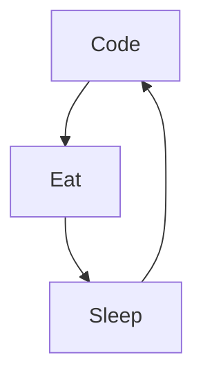

### Hi Everyone, I'm Maxvyr

<!--
**Maxvyr/Maxvyr** is a ✨ _special_ ✨ repository because its `README.md` (this file) appears on your GitHub profile.

Here are some ideas to get you started:
-->

- 🔭 I’m currently working on an [iOS Application](https://apps.apple.com/fr/app/tengu-sensei/id1558435052) and [Android Application](https://play.google.com/store/apps/details?id=com.pandamy.tengu_sensei) and there [website](https://tengusensei.com/) 
<!-- - 🌱 I’m currently learning **[SwiftUI](https://developer.apple.com/xcode/swiftui/)** -->
- 👯  I’m looking to collaborate on **OpenSource Projects**

- 📫 How to reach me: **[Twitter](https://twitter.com/m4xvyr)**, **[LinkedIn](https://www.linkedin.com/in/maxime-vidalinc)**, **[Youtube](https://www.youtube.com/user/maxvid30)**, **contact@pandamy.xyz**
- ⚡ About Me: 
  - **🧑‍💻 Indie Makers**
  - **🧘 Personnal developpment**
  - **🏦 finance**
  - **🛫 South Asia**
  - **💖 japan 🇯🇵, korean 🇰🇷, chinese 🇹🇼🇨🇳 culture**

### Connect with me:

### Languages and Tools:

 
 

### My daily routine :

### ⭐ GitHub Stats

 

