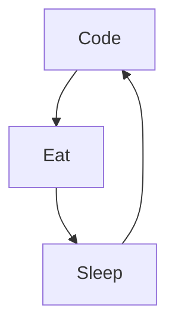

### Hi Everyone, I"m Maxvyr

<!--
**Maxvyr/Maxvyr** is a ✨ _special_ ✨ repository because its `README.md` (this file) appears on your GitHub profile.

Here are some ideas to get you started:
-->

- 🔭 I’m currently working on Mobile Application
- 🌱 I’m currently learning [Swift](https://www.swift.org/)
- 👯 I’m looking to collaborate on Dart/Flutter project
- 🤔 I’m looking for help with SwiftUI
- 📫 How to reach me: [Twitter](https://twitter.com/m4xvyr) or [LinkedIn](https://www.linkedin.com/in/maxime-vidalinc)
- ⚡ Fun fact: ...

### Connect with me:

### Languages and Tools:

 
 

### My daily routine :

<!--
### 🔥 Recent GitHub Activity
-->
<!--START_SECTION:activity-->

<!--END_SECTION:activity-->

### ⭐ GitHub Stats

