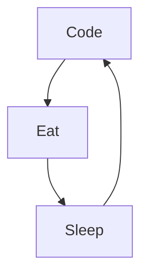

### Hi Everyone, I"m Maxvyr

<!--
**Maxvyr/Maxvyr** is a ✨ _special_ ✨ repository because its `README.md` (this file) appears on your GitHub profile.

Here are some ideas to get you started:
-->

- 🔭 I’m currently working on Mobile and Web Application
- 🌱 I’m currently learning [Dart](https://dart.dev/), [Swift](https://www.swift.org/)
- 👯 I’m looking to collaborate on Dart/Flutter 💙 project
- 🤔 I’m looking for help with SwiftUI
- 📫 How to reach me: [Twitter](https://twitter.com/m4xvyr) or [LinkedIn](https://www.linkedin.com/in/maxime-vidalinc)
- ⚡ Fun fact: I'm in love with the japan culture 🇯🇵🍙

### Connect with me:

### Languages and Tools:

 
 

### My daily routine :

```mermaid
  graph TD;
      Code-->Eat;
      Eat-->Sleep;
      Sleep-->Code;
```

<!--
### 🔥 Recent GitHub Activity
-->
<!--START_SECTION:activity-->

<!--END_SECTION:activity-->

### ⭐ GitHub Stats

![Metrics](https://metrics.lecoq.io/maxvyr?template=classic&languages=1&stars=1&projects=1&achievements=1&notable=1&tweets=1&anilist=1&stock=1&base.indepth=false&base.hireable=false&languages.limit=8&languages.threshold=0%25&languages.other=false&languages.colors=github&languages.sections=most-used&languages.indepth=false&languages.analysis.timeout=15&languages.categories=markup%2C%20programming&languages.recent.categories=markup%2C%20programming&languages.recent.load=300&languages.recent.days=14&stars.limit=4&projects.limit=4&projects.descriptions=false&achievements.threshold=C&achievements.secrets=true&achievements.display=detailed&achievements.limit=0&notable.from=organization&notable.repositories=false&notable.indepth=false&notable.types=commit&anilist.medias=anime%2C%20manga&anilist.sections=favorites&anilist.limit=2&anilist.limit.characters=22&anilist.shuffle=true&anilist.user=.user.login&tweets.attachments=false&tweets.limit=2&tweets.user=.user.twitter&stock.duration=1d&stock.interval=5m&config.timezone=Europe%2FParis)
>>Q